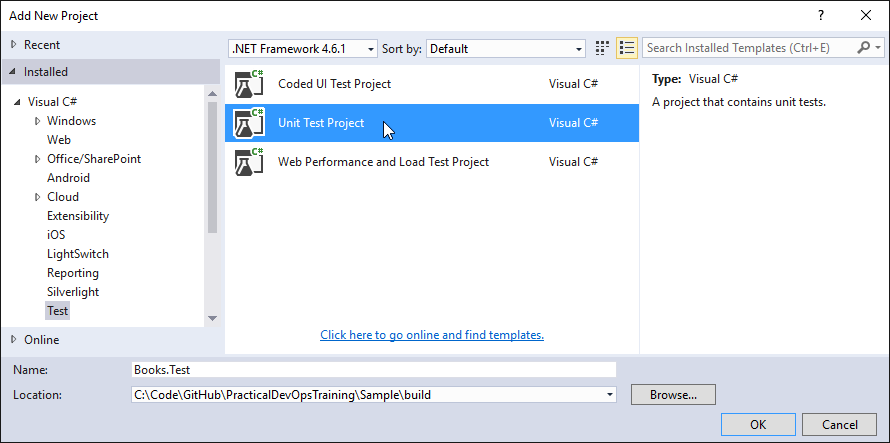
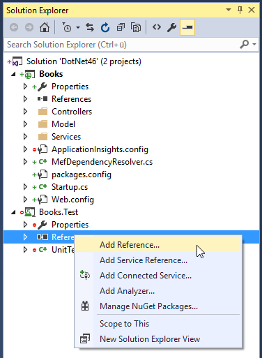
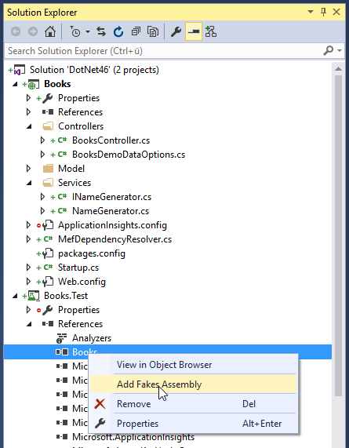
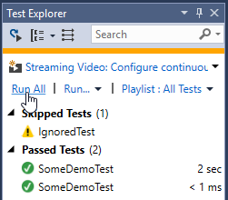

# Exercise 3


## Learnings

1. Basics about test projects
1. Mocking dependencies using *Fakes*
1. Hosting Web API in tests using OWIN


## Add Test Project

1. Add a test project to your Visual Studio solution.<br/>
   

1. Remove generated `UnitTest1.cs`.

1. Remove `ApplicationInsights.config` (not necessary for this demo).

1. Add a reference to the Web API project from your new test project.<br/>
   

1. Add references to the following framework assemblies:
   * `System.ComponentModel.Composition`
   * `System.ComponentModel.Composition.Registration`
   * `System.Reflection.Context`

1. Install necessary NuGet packages by running the following commands in Visual Studio's *Package Manager Console* (you can use *Manage NuGet Packages for Solution* instead if you prefer GUI over PowerShell):
   * `Install-Package Microsoft.AspNet.WebApi.Owin -Project Books.Test`
   * `Install-Package Microsoft.Owin.Host.SystemWeb -Project Books.Test`
   * `Install-Package Microsoft.AspNet.WebApi.OwinSelfHost -Project Books.Test`

## Add and Run Tests

1. Add *Fakes* assembly for `Books` reference:<br/>
   
   
1. Replace `Fakes/Books.fakes` with the following code:
   ```
    <Fakes xmlns="http://schemas.microsoft.com/fakes/2011/">
        <Assembly Name="Books"/>
        <StubGeneration>
            <Clear/>
            <Add TypeName="INameGenerator"/>
        </StubGeneration>
        <ShimGeneration>
            <Clear/>
        </ShimGeneration>
    </Fakes>
   ```

1. Copy `.cs` files from [Assets/Exercise-3-Tests](Assets/Exercise-3-Tests) into your test project. Make yourself familiar with the two test files. Note how OWIN is used to host a web server for an integration test.

1. Build your test project. There should not be errors.

1. Open Visual Studio's *Test Explorer* and run all tests.<br/>
   

