# Exercise 6

## Learnings

1. Basics about Visual Studio Team Services
1. Committing code to VSTS using Git and Visual Studio
1. Setting up automated build
1. Connecting VSTS and Azure
1. Setting up VSTS Release Management 

## Create Visual Studio Team Services Project

1. Navigate to [Visual Studio Team Services](https://www.visualstudio.com) (VSTS) and create a new subscription if you do not already have one.

1. Navigate to your VSTS subscription. In my case the URL is `https://rainerdemotfs-westeu.visualstudio.com/`. Replace this URL with your personal VSTS URL.

1. Create a new VSTS project `PracticalDevOps`. Make sure you select *Git* for Version control. 
   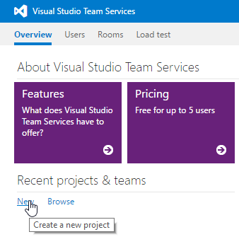
 
1. Navigate to your new project.

## Commit Code to Visual Studio Team Services

1. In Visual Studio's *Team Explorer*, select *Connect to Team Project*. 
   

1. Add your VSTS server and select the `PracticalDevOps` project.

1. Clone the project to a **new local directory**. 
   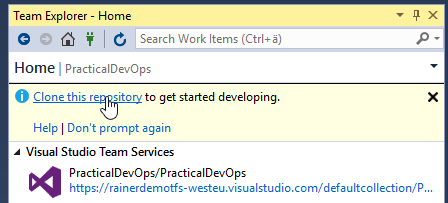

1. Copy the code your created in the previous exercises into the new local directory.

1. Copy the `.gitignore` file from [Exercise-6-VSTS-Source-Control](Assets/Exercise-6-VSTS-Source-Control/.gitignore) into the new local directory.

1. In Visual Studio's *Team Explorer*, goto *Changes*, review the changes that Visual Studio has detected (see image below), and commit your changes. 
   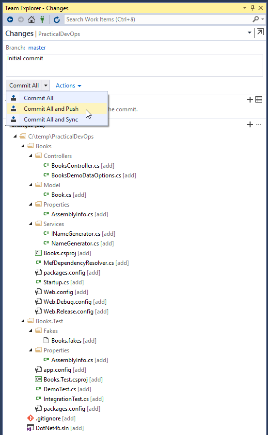

1. Take a look at the committed code in the VSTS portal. 
   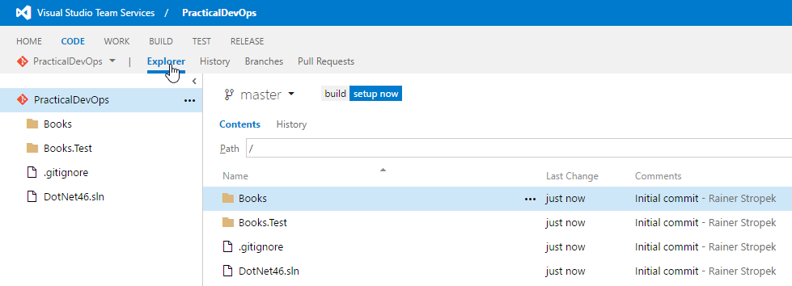
   

## Setup Build

1. Click on *build setup now* in VSTS. 
   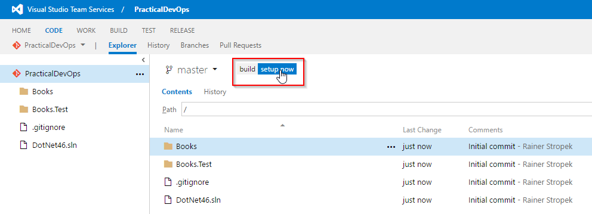

1. Accept the suggestions of the Build Setup Wizard.

1. Add the following arguments to MSBuild in step *Visual Studio Build* (necessary for creating the Web Deploy package): `/p:DeployOnBuild=true /p:WebPublishMethod=Package /p:PackageAsSingleFile=true /p:SkipInvalidConfigurations=true /p:PackageLocation="$(build.stagingDirectory)"` 
   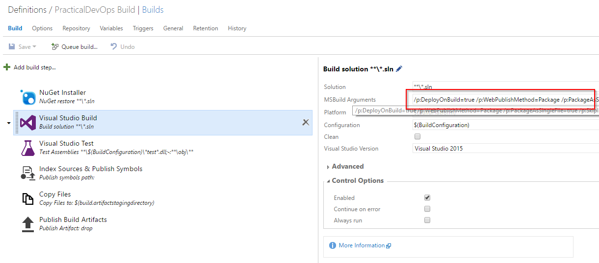

1. Save the generated build definition with the name `PracticalDevOps Build`
   
1. Setup Continuous Integration (CI) by creating a trigger. 
   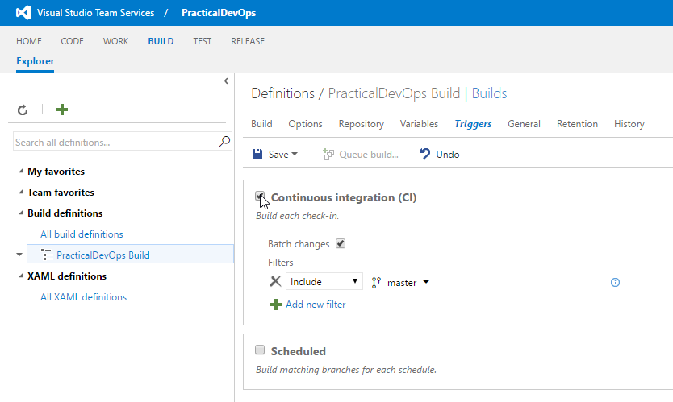

1. Queue a new build. 
   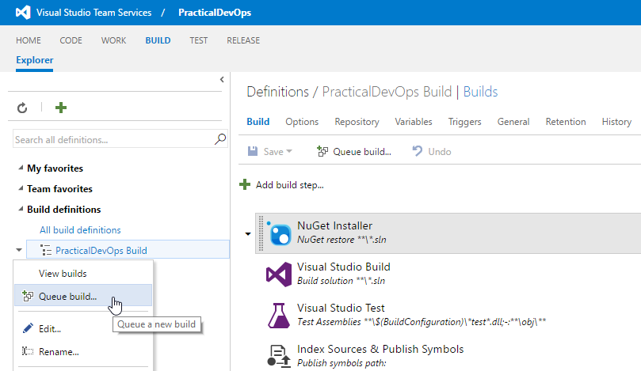

1. Watch how the hosted build controller builds your code. You should not get any errors.

1. Take a look at the build results. 
   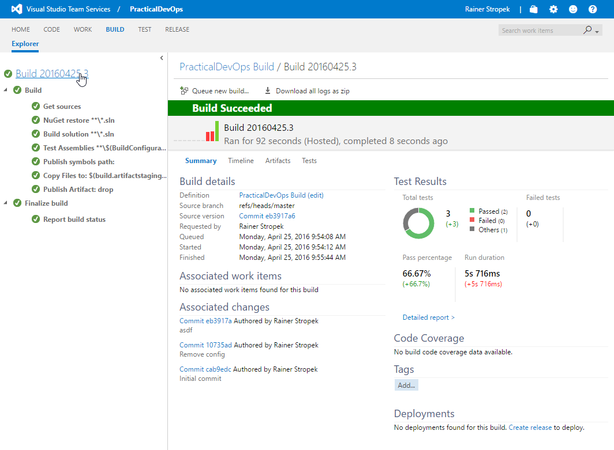^
   
1. For testing purposes, screw up tests (e.g. by removing the `Ignore` attribute from test `IgnoredTest`), check your changes in, and see the build failing. Remember to fix your code again so that you can continue with the rest of the exercise.
   

## Setup Release Management

1. In VSTS project options, goto *Services* area. Add a service endpoint for Azure 
   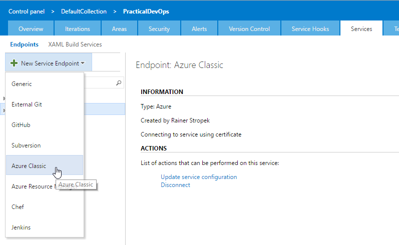

1. Select *Certificate Based* and follow the link *download publish settings file*. Open the publish settings file and copy the required data into VSTS.

1. In build results, follow the link to create a release. 
   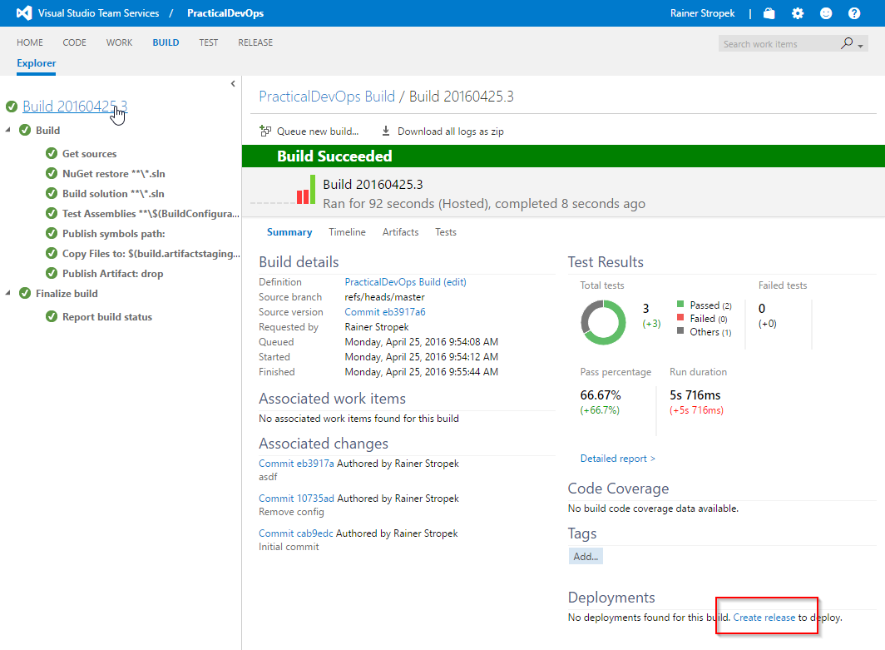

1. Setup deployment to Azure Web App. 
   

1. Setup Continuous Deployment by creating a trigger. 
   
   
1. In order to automate deployment, create a *Deployment Condition*. 
   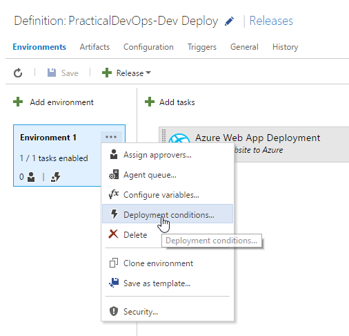

1. Trigger deployment automatically whenever a release has been created. 
   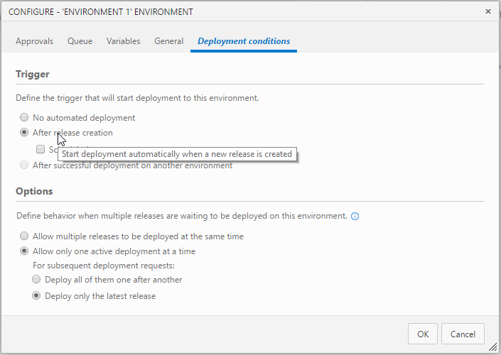

1. Now you can test the entire pipeline. Change someting in your code (e.g. appending a `!` to the title) and check your code in. The build should be triggered automatically. The release should be created after the successful build. The release should be immediately be published to Azure App Services.

